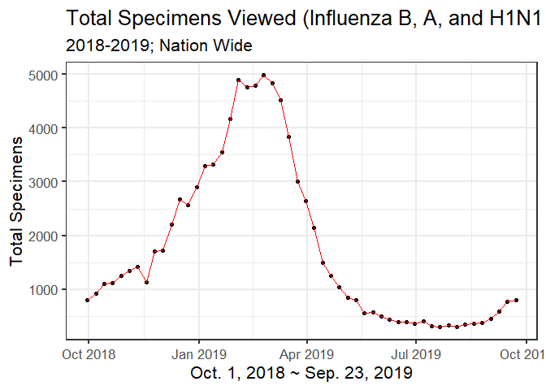
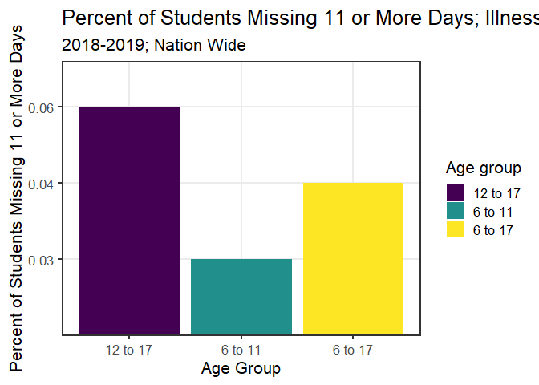
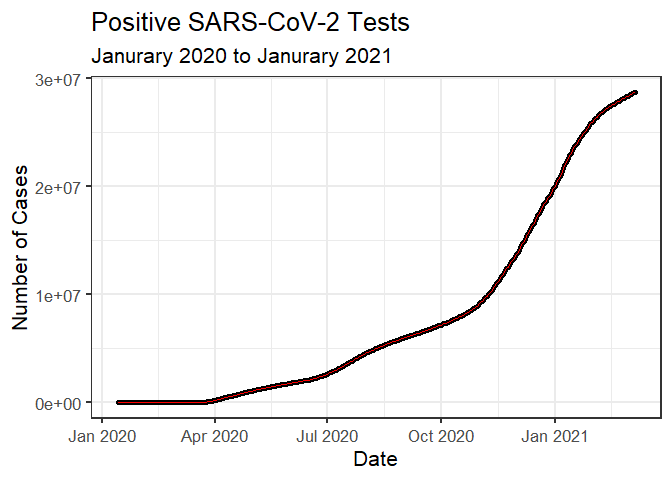

## Title

The Impact on Education Due to SARS-CoV-2 in 2020 - 2021 Versus the
Impact on Education Due to Influenza in 2018-2019

## Author

Allyson Godel, Bio-sciences Department, Minnesota State University
Moorhead

An exploratory data analysis for BIOL 275 Quantitative Biology at
Minnesota State University Moorhead

## Introduction

As SARS-CoV-2 began its tyranny throughout the world, many variables of
everyone’s life were altered in order to battle this change. Along with
excessive hand washing, toilet paper hoarding, and Zoom stocks
skyrocketing, how education was given and received was altered in both
good and bad ways during this panic. Using the comparison of positive
tests regarding both SARS-CoV-2 and Influenza in 2018-2019 allows us to
visually observe the differences in how these viruses caused change
throughout the education system.

## Methods

Websites used:

-   <https://gis.cdc.gov/> In order to get to the Influenza data set, a
    simple “Influenza” search in the top right search bar will result in
    several data sets. The data set titled “Data Visualization and
    Interactive Mapping for Flu Surveillance \| Place and Health” will
    be where we find our data sets. Once this link is clicked, a web
    page explaining the Flu Mapping tool will lead you to the “FluView
    Interactive” tool, which is located under the heading “Interactive
    Flu Surveillance. Once this link is clicked, we can simply follow
    the prompt to”view both influenza laboratory data and medically
    attend visits for influenza-like illness…“. Once on this interactive
    page, we specify our”Season” as 2018-2019, then observe the data
    produced on the “Stacked Column Chart WHO/NREVSS”. This data set
    allows us to see who was previously affected by influenza in the
    year 2018-2019.

-   <https://datacenter.kidscount.org/> By selecting “View U.S. Data”,
    you will be able to view any data presented on this website. By
    specifying and clicking “COVID-19” under the “Special Topics”, you
    are able to scroll down and find the “Education Indicators” topic,
    which will house our data set under the “School Age” section. We are
    able to open the data set “Change in how households with children
    received education due to the SARS-CoV-2 pandemic”, which houses a
    portion of the data set used. By selecting “View U.S. Data”, you
    will be able to view any data presented on this website. By
    specifying and clicking “Education” under the “Topics” tab, you are
    able to scroll down and find the “School Age” topic, which will
    house our data set under the “Children who missed 11 or more days of
    school per year due to illness or injury”. Specifications of year
    can be made. In this case, 2018-2019 was viewed and used in this
    data set. <https://covidtracking.com/data/download> This website
    allows you to download specific state information regarding trends
    during the SARS-CoV-2 pandemic. For this research, we will be using
    the “summary data for the United States”, which can be downloaded
    directly under the “National data” heading.

-   RStudio Team (2020). RStudio: Integrated Development for R. RStudio,
    PBC, Boston, MA URL <http://www.rstudio.com/>. in regards to coding
    and manipulating of data sets into visual information

-   <https://www.mnstate.edu/library/> in regards to peer reviewed
    sources

## Results

After selecting the data necessary to make an assessment, not only was
there an increase in absences during the height of Influenza, but an
increase in altered education before, during, and after the SAR-CoV-2
pandemic.

<!-- -->

<!-- -->

<!-- -->

> S - Estimates suppressed when the effective sample size is less than
> 30 or the 90% confidence interval is greater than 30 percentage points
> or 1.3 times the estimate

## Discussion

After observing the graphs representing the influenza increase and 11 or
more days missed, we are able to come to conclude there was an increase
in percent of students who missed school due to injury or illness.
Observing the age group “6-12”, we are able to notice a vast increase in
percent around the same time period of an increase in influenza results.
Although this increase is noted, it does not hold the same immense
amount of increase of education delay the SARS-CoV-2 pandemic held upon
the distribution of education. When observing the increase in positive
results regarding COVID, we can observe an increase in education using
online resources. This use of online resources and paper materials was
highest at the beginning, died down, then increased once again with the
introduction of a second variant of the virus. As we observe these
graphs around the beginning of October (the beginning of the second
variant), we are able to observe an overall increase in online and paper
material being used in schools. At that time, many school districts were
also taking action by socially distancing their students, canceling
classes such as physical education, and requiring a mask mandate. This
defense plays into the last two graphs, which represents the overall
change and operation of education systems after these changes were
implemented (remaining and enforcing these defensive tactics to avoid
the virus). Overall, these graphs both represent the education system
and how affected it becomes on impact of viruses in general, however
also represents the immense amount of safety put into the system.
Throughout this pandemic, education systems have remained vigilant and
continue to fight for childrens’ rights to remain educated.

The distribution of education and curriculum given has changed greatly
since the pivoting beginning months of SARS-CoV-2 began, however Scott,
I.(2020) reflected upon how important this pivot truly is. As we change
our curriculum distribution, we also allow ourselves to view and
understand if this information and learning truly influences our
students’ learning. We truly began to see if the education prior to the
pandemic was that influential. Although this altered education for some
professors and instructors might have been tough, Patson, T.(2021),
supported the notion through surveys that students are, in fact,
positively shifting this once confusing technique of online school. This
article speaks upon the overall sustaining positive attitudes students
continued to have towards education even after the shift to online
learning. This shift possibly teaches students self-efficacy without the
social construct of a day to day school life. 

    Although the SARS-CoV-2 pandemic has been beyond destructive towards education, careers, and overall living, convenience of a vaccine that has a probability of softening the impact is key to this rebound. Similar to the Influenza outbreak in 2019, Adams, Lavonne. (2019), and his team of researchers were able to observe the impact of convenient vaccines through the distribution at TCU (Texas Christian University). This knowledge allows us to better comprehend the nature of individuals as we continue to distribute the vaccine or boosters. A main issue is the lack of distribution being convenient. However, some vaccines are harder to obtain than others, thus lulling schools into a false sense of security. Llupia, Anna (2021) reported the mistake of public schools in Catalonia, Spain when reopening their doors to students. Although similar to some schools here in America, the safety measures were majorly lacking as the virus was still changing and altering. This mistake led to many of the 778,000 students not only contracting the virus, but also bringing this deadly issue home.

## References

    Centers for Disease Control and Prevention. (n.d.). National, regional, and state level outpatient illness and viral surveillance. Centers for Disease Control and Prevention. Retrieved April 3, 2022, from https://gis.cdc.gov/grasp/fluview/fluportaldashboard.html 

    Data download. The COVID Tracking Project. (n.d.). Retrieved April 3, 2022, from https://covidtracking.com/data/download 

    Children who missed 11 or more days of school per year due to illness or injury: Kids Count Data Center. KIDS COUNT data center: A project of the Annie E. Casey Foundation. (n.d.). Retrieved April 3, 2022, from https://datacenter.kidscount.org/data/tables/9714-children-who-missed-11-or-more-days-of-school-per-year-due-to-illness-or-injury?loc=1&loct=1#detailed/1/any/false/1696,1648,1603/18,691,30/18960 

    Change in how households with children received education due to the coronavirus pandemic: Kids Count Data Center. Change in how households with children received education due to the coronavirus pandemic | KIDS COUNT Data Center. (n.d.). Retrieved April 3, 2022, from https://datacenter.kidscount.org/data/map/10883-change-in-how-households-with-children-received-education-due-to-the-coronavirus-pandemic?loc=24&clean=true

## Peer Reviewed Sources

    Scott, I.,(2020). Education during COVID‐19: pivots and consequences. Vol.17 (4), p. 443-444 https://mnpals-msumoor.primo.exlibrisgroup.com/discovery/fulldisplay?docid=cdi_proquest_miscellaneous_2460766624&context=PC&vid=01MNPALS_MSUMOOR:MSUMOOR&lang=en&search_scope=MyInst_and_CI&adaptor=Primo%20Central&tab=Everything&query=any,contains,education%20COVID&offset=0&fbclid=IwAR0QoWyWqRrwHSdESAEnGdOf1UaLvpqY2udqRVRmMVa3RO6P4gD2DMg7KeU

    Patston, T., Kennedy, J., Jaeschke, W., Kapoor, H., Leonard, S., Cropley, David H., Kaufman, James C., (2021). Secondary Education in COVID Lockdown: More Anxious and Less Creative- Maybe Not? Vol.12, p.613055-613055. https://mnpals-msumoor.primo.exlibrisgroup.com/discovery/fulldisplay?docid=cdi_doaj_primary_oai_doaj_org_article_c4cdc16ed4e1422faacd28183c0c1a61&context=PC&vid=01MNPALS_MSUMOOR:MSUMOOR&lang=en&search_scope=MyInst_and_CI&adaptor=Primo%20Central&tab=Everything&query=any,contains,education%20COVID&offset=0&fbclid=IwAR0A2NHDrD5n2fi_rfkzTB7iwCYa6aHtpyRjLb4CT-9o_zBEnZIgTeXNRyM

    Adams, Lavonne M., Canclini, Sharon, Tillman, Kelle. (2019). “This is not a drill”: Activation of a student-led influenza vaccination point of dispensing. Vol.67 (2), p.88-91. https://mnpals-msumoor.primo.exlibrisgroup.com/discovery/fulldisplay?docid=cdi_proquest_miscellaneous_2025316777&context=PC&vid=01MNPALS_MSUMOOR:MSUMOOR&lang=en&search_scope=MyInst_and_CI&adaptor=Primo%20Central&tab=Everything&query=any,contains,Students%20Influenza&offset=0

    Llupia, Anna, Borras-Santos, Alecia, Guinovart, Caterina, Utzet, Mireia, Morina, David, Puig, Joaquim, Thome, Beatriz, (2021). SARS-CoV-2 transmission in students of public schools of Catalonia (Spain) after a month of reopening. Vol.16 (5), p.e0251593-e0251593. https://mnpals-msumoor.primo.exlibrisgroup.com/discovery/fulldisplay?docid=cdi_doaj_primary_oai_doaj_org_article_3a5d27b4e5984126918ffe59889398b2&context=PC&vid=01MNPALS_MSUMOOR:MSUMOOR&lang=en&search_scope=MyInst_and_CI&adaptor=Primo%20Central&tab=Everything&query=any,contains,Students%20SARS&offset=0

## Acknowledgements

Chris Merkord, PhD Associate Professor
